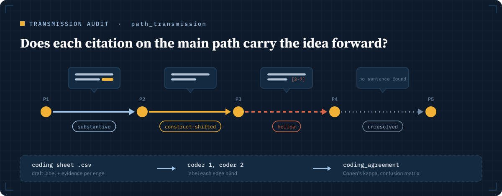

# Audit

A citation analysis rests on three things you rarely see: whether the citer
set is complete, whether the reference lists are complete, and whether a
citation carries an idea or only mentions it. The audit tools make each of
these a reported part of the study.

## Is the citer set complete?

`resolve_citers` finds every paper citing one or more seeds, by several
search strategies at once. It runs `REF()` on each seed plus any extra
`queries` you give, for example a title-phrase search such as
`REFAUTH(swanson) AND REFTITLE("organizing vision")`. It merges the hits and
then opens each hit's own reference list to confirm that the seed is there.

The reply has a table per strategy: hits, confirmed, unconfirmed,
verification failed, and the confirmed citers that strategy missed. That
table shows how much a single `REF()` search would have lost.

With `cross_check` (on by default when you set `scope`), it also asks
OpenAlex and Semantic Scholar which in-scope papers cite the seeds. It lists
the ones Scopus misses or cannot confirm, with Scopus's reference count next
to the external one, so truncated Scopus reference lists become visible. The
Scopus result itself stays Scopus-only.

`index_coverage` asks the same question of all three indexes under the same
journal scope and reports how their citer sets overlap. Papers are matched by
DOI, else by title and year.

## Are the reference lists complete?

`get_references` with `check_completeness=true` compares one paper's
retrieved list with the reference count the publisher deposited at Crossref.
`citation_network` runs this check on every paper by default. A list counts
as short when it has fewer than 90% of the comparison count and at least five
references missing. Both thresholds are settings
(`SCOPUS_COMPLETENESS_RATIO`, `SCOPUS_COMPLETENESS_MIN_MISSING`).

## Does a citation carry the idea?

`citation_context` returns how one paper cites another: the citing
sentences, the citation intent (background, methodology or result), and
whether Semantic Scholar classes the citation as influential. When Semantic
Scholar has no usable sentences, it searches the citing paper's full text
instead, from ScienceDirect or an open-access copy. Up to 50 pairs per call.

`path_transmission` applies this to every edge of a main path. For each
consecutive pair it gathers the citing sentences, the intent and influential
flags, how many sentences name your construct terms, and whether the
citation sits in a list of three or more works. It then proposes a draft
label per edge:

| Draft label | When |
| --- | --- |
| substantive | The citing paper engages the cited work, and a sentence names the construct in the cited work's own clause |
| construct-shifted | The citing paper engages the cited work without naming the construct |
| hollow | Only background or list citations |
| unresolved | No citing sentences from any source |

The draft labels are heuristics for a human coder to confirm or overturn.
The tool writes them to a CSV coding sheet with blank columns for two
independent coders.

`coding_agreement` reads the sheet once both coders have filled it in. It
reports Cohen's kappa with a 95% interval and its Landis and Koch reading,
agreement per label, the confusion matrix and the edges the coders disagree
on. It also scores the draft labels against each coder and against their
consensus, which tells you how far the heuristic can be trusted. It reads
comma, semicolon or tab-separated files, as Excel saves them.

## Retractions

`check_retractions` looks up retractions, withdrawals, expressions of concern
and corrections in Crossref, which carries the Retraction Watch database.
Give it DOIs, Scopus IDs or a `corpus_file`. `citation_network` runs the same
check on every network by default.

Parameters for every tool: [tool reference](tools.md#audit).
