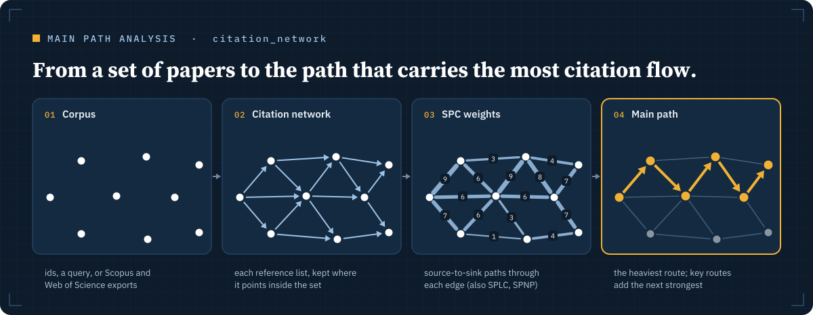

# Citation networks and main paths

Seven tools turn a set of papers into networks. They show which papers share
references, which older works are cited together, how one paper's influence
spreads over generations, and which route through the literature carries the
most citation flow. All seven run on Scopus, or on OpenAlex with
`source="openalex"` (see [data sources](data-sources.md)).

## Which tool answers which question

| Question | Tool | Writes |
| --- | --- | --- |
| Which current papers work on the same problem? | `bibliographic_coupling` | GraphML, CSV edge list |
| Which older works does the field treat as its base? | `co_citation` | GraphML, CSV edge list |
| How did one paper's influence spread? | `citation_lineage` | JSON corpus, HTML graph, PNG |
| Which route through a set of papers carries the most citations? | `citation_network` | JSON, Pajek `.net`, edge CSV |
| Which papers anchor the set, and when? | `historiograph` | PNG, Pajek `.net` |
| Which years does the field draw its history from? | `rpys` | CSV spectrogram, PNG |
| Which conversations make up the set? | `research_fronts` | JSON, Pajek `.net` and `.clu` |

## Coupling and co-citation

Both tools take a list of seed papers and link them in pairs.

`bibliographic_coupling` links two seeds when they cite the same works. The
edge weight counts the shared references, and the cosine is the Salton
index. Papers that cite alike tend to work on the same problem, so coupling
maps the current research front.

`co_citation` links two seeds when a later paper cites both. The weight
counts those later papers. Works that the field keeps citing together form
its intellectual base. `max_citing_per_seed` (default 500) caps the citing
papers fetched per seed, which bounds the quota used.

`min_shared` (default 2) drops weak edges in both tools.

## Lineages

`citation_lineage` walks out from one seed paper. Forward, generation 1 is
the papers citing the seed and generation 2 is the papers citing those, up to
three generations. Backward, it walks reference lists instead. Every paper
appears once, however many routes reach it.

The forward walk ranks citers by citation count by default (`sort="citedby"`),
so it follows the most-cited work first and keeps the backbone of the
lineage. `sort="coverDate"` follows the newest work first, which shows the
current edge of the field but can let recent papers crowd out the backbone.
`max_per_node` (default 200) caps the citers taken per paper, `min_citing`
skips papers with few citers, and `scope` keeps only citers in chosen
journals, for example the Basket of Eight.

The result is a JSON corpus, an interactive HTML graph and a PNG, with the
main path named in the reply.

## The citation network and its main path

`citation_network` builds the direct-citation network inside any set of
papers. It fetches each paper's reference list and keeps only the references
that point to other papers in the set. Give it `ids` (up to 1000), a
`query`, or a `corpus_file` from `import_records`.

It then runs main path analysis (Liu and Lu 2012):

- Each edge gets a traversal weight. SPC, the default, counts the
  source-to-sink paths running through the edge. SPLC counts paths starting
  at any paper, and SPNP paths between any two papers. Pick one with
  `weight`.
- The local main path starts at the sources and follows the heaviest edge at
  each step. The global main path is the heaviest whole path.
- Key routes start from the `key_routes` heaviest edges (default 10) and
  extend each one into a path, locally or globally (`key_route_search`).
- With `robustness` on (the default), the global main path is computed under
  all three weights and the reply lists the papers they share. A path that
  survives a change of weight is a finding. One that does not is partly an
  artefact of the weight.

The network is only as good as its reference lists, so the tool checks them.
Each list is compared with an independent count from Crossref, OpenAlex or
Semantic Scholar, and lists that look short are flagged. Papers whose
references could not be loaded are listed and retried, and the main path is
marked provisional while any are missing. Likely duplicate records and
retracted papers are flagged too.

Sets of more than about 50 papers can take longer than the client waits. The
tool then returns a job ID: ask for `job_status`, then `job_result`.

## Historiograph, RPYS and research fronts

These three describe a set of papers from different angles. Each takes
`ids`, a `query` or a `corpus_file`.

`historiograph` draws Garfield's historiograph: the papers most cited within
the set on a time axis, the citations among them, and the global main path
highlighted. `top` sets how many papers to draw (default 30).

`rpys` runs Reference Publication Year Spectroscopy (Marx et al. 2014). It
counts every cited reference by the year the cited work appeared, subtracts
the five-year median, and reports the peak years with the works cited most
from each. The peaks are the set's historical roots.

`research_fronts` splits the direct-citation network into Louvain
communities, as CitNetExplorer does. Each front is described by its years,
density, core papers and distinguishing keywords. The reply also places every
paper of the global main path in its front. A path that stays in one front
traces a single conversation. A path that hops between fronts stitches
several together.

## Opening the results elsewhere

Every network is written to disk as well as summarised in the reply.

- `citation_network` writes a Pajek `.net` file with arcs from cited to
  citing paper and SPC weights. Pajek, VOSviewer and Gephi open it.
- `research_fronts` adds a `.clu` partition file, so the fronts colour the
  network in Pajek.
- Coupling and co-citation write GraphML and a CSV edge list.

## Drawing the map with the main-path skill

The Claude Code plugin installs the
[main-path skill](../plugins/scopus-plus-mcp/skills/main-path/README.md). It
walks Claude through a main path analysis from a query to a drawn map. For
Claude Desktop, zip its folder and upload it as a skill.

Parameters for every tool: [tool reference](tools.md#networks-and-lineage).
